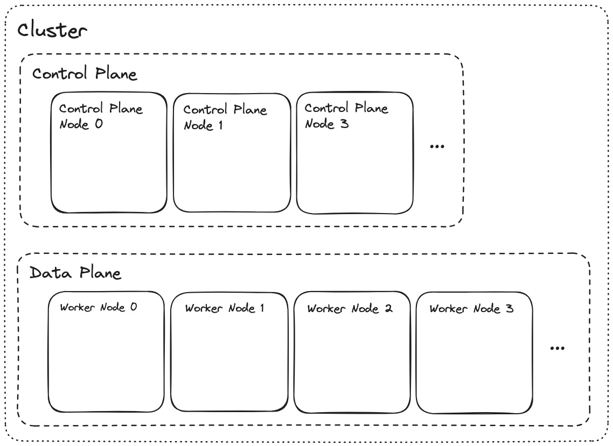
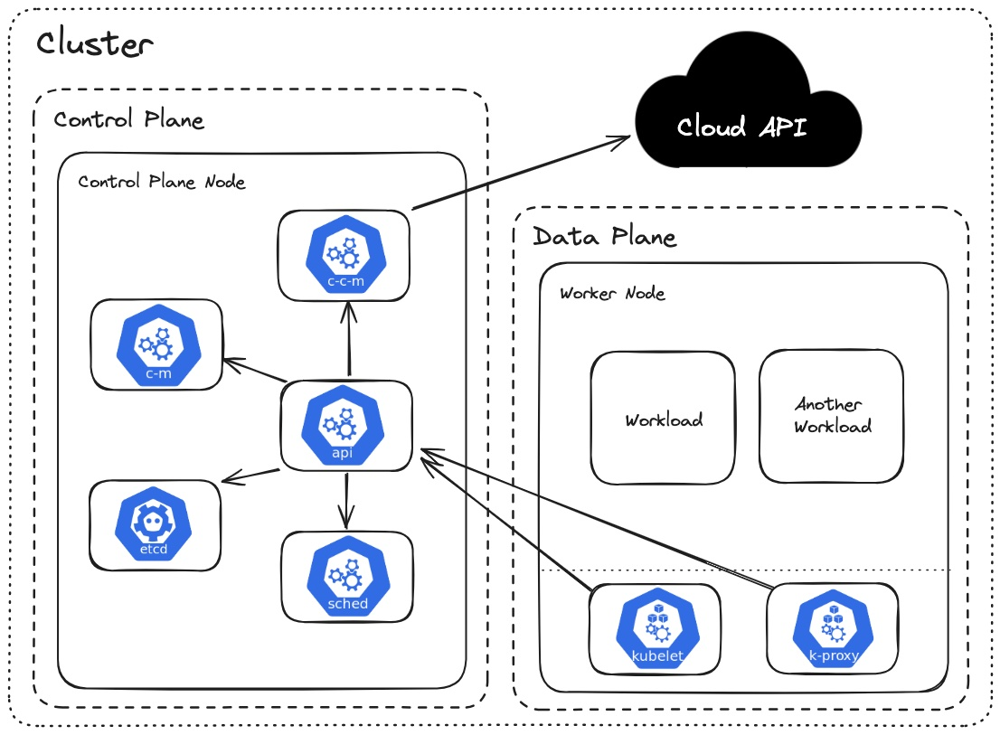

# Technology Overview

## Planes and Nodes

The first concepts to understand with regard to kubernetes are:

- **Node:** A "node" is a computer/server. Multiple nodes are joined together to form a "cluster".
- **Control Plane:** A subset of nodes in the cluster dedicated to performing system tasks. Nodes that are part of the control plane are referred to as "control plane nodes".
- **Data Plane:** A subset of nodes in the cluster dedicated to running user worklods. Nodes that are part of the data plane are referred to as "worker nodes".

## Kubernetes System Components

Kubernetes is comprised of many smaller components:

- **etcd**: Key-value store used for storing all cluster data. It serves as the source of truth for the cluster state and configuration.

- **kube-apiserver**: The front end for the Kubernetes control plane.

- **kube-scheduler**: Schedules pods onto the appropriate nodes based on resource availability and other constraints.

- **kube-controller-manager**: Runs controller processes. Each controller is a separate process that manages routine tasks such as maintaining the desired state of resources, managing replication, handling node operations, etc...

- **cloud-controller-manager**: Integrates with the underlying cloud provider (if running in one) to manage cloud-specific resources. It handles tasks such as managing load balancers, storage, and networking.

- **kubelet**: An agent that runs on each worker node and ensures that containers are running in pods and manages the lifecycle of containers.

- **kube-proxy**: This network proxy runs on each node and maintains network rules to allow communication to and from pods.

- 
