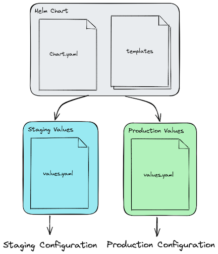

# Helm

Helm (https://helm.sh/) has become the de facto standard for packaging and distributing applications for kubernetes.

It provides a way to assemble many kubernetes resources and uses go's templating language to create custom interfaces so that consumers of the chart can configure the installation to meet their needs.



The fact that it is the most popular does not mean it is the only (or even the best) way to package kubernetes applications. In `12-deploying-to-multiple-environments` I will cover additional methods, but Helm is common enough that it is worth covering here.

## 3rd Party Example

### Bitnami/Postgresql

We will use a popular open source helm chart for installing PostgreSQL to show the common types of actions you will take when using 3rd party helm charts.

https://github.com/bitnami/charts/tree/main/bitnami/postgresql

- `helm repo add`: Adds the Bitnami chart repository to Helm's local list of chart repositories.
- `helm search repo`: Searches for available charts within the Bitnami repository.
- `oras repo tags`: Searches for tags in an OCI-compliant registry.
- `helm pull`: Downloads the PostgreSQL chart locally.
- `helm show values`: Displays the default values used by the chart.
- `helm install`: Installs the PostgreSQL chart into a Kubernetes cluster.
- `helm upgrade`: Upgrades the deployed PostgreSQL release to a newer chart version.
- `helm rollback`: Rolls back the PostgreSQL release to a previous version.
- `helm list`: Lists Helm releases deployed in the Kubernetes cluster.
- `helm get values`: Retrieves the values used for the deployed PostgreSQL release.
- `helm get manifests`: Shows the Kubernetes manifests of the deployed PostgreSQL release.
- `helm-uninstall`: Uninstalls the PostgreSQL release from the Kubernetes cluster.

## 1st Party Examples

### Helm Create

The helm cli provides a command that can be used to create a new chart:

```
helm create <CHART_NAME>
```

This provides a starting point with the necessary boilerplate for creating a chart, and also demonstrates many features of helm. If you were to use this to bootstrap a chart of your own, you would replace the files in the `templates` directory with your own.

The repo includes an unmodified version of this chart for observation.

### Minimal Example

A super minimal example helm chart that deploys a single `ConfigMap`. While the configuration is minimal, it uses the following features of helm templating, which cover a majority of the various use cases required for most helm charts:

1. variables (`define`)
2. conditionals (`if`)
3. foreach (`range`)
4. `.Release`
5. `.Chart`
6. `.Values`
