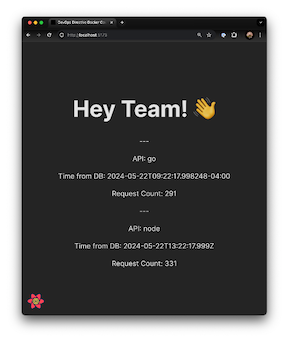
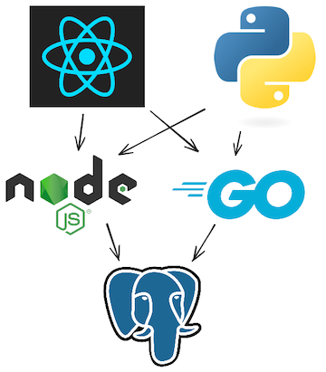

# Demo Application

## Minimal 3 tier web application

- **React frontend:** Uses react query to load data from the two apis and display the result.
- **Node.js and Go APIs:** Both have `/` and `/ping` endpoints. `/` queries the Database for the current time and the number of requests for each api recorded within the database, and `/ping` returns `pong`.
- **Postgres Database:** An empty PostgreSQL database with no tables or data. Used to show how to set up connectivity. The API applications execute `SELECT NOW() as now;` to determine the current time to return.
- **Python Load Generator:** Queries one of either the Node.js or Go APIs at a configurable speed.

The demo application builds upon the one used in the [DevOps Directive Docker Course](https://github.com/sidpalas/devops-directive-docker-course/tree/main/05-example-web-application).

It adds a simple load generator written in python and adds a simple database schema to track requests to each API.

## Running the Application

While the whole point of this course is that you probably won't want/need to run the application locally, we can do so as a starting point.

The Taskfile contains the commands to start each application:

### Postgres

It's way more convenient to run postgres in a container, so we will do that.

`task postgresql:run-postgres` will start postgres in a container and publish port 5432 from the container to your localhost.

**🚨 NOTE:** After starting the database, you need to run the migration file in `./postgresql/migrations` to create the table that the APIs use. This can be done with `postgresql:run-psql-init-script`.

### api-node

To run the node api you will need to `task api-node:install` to install the dependencies.

After installing the dependencies, `task api-node:run` will run the api in development mode with nodemon for restarting the app when you make source code changes.

### api-golang

To run the golang api you will need to run `task api-golang:install`.

After installing the dependencies, `task api-golang:run` will build and run the api.

### client-react

Like api-node, you will first need to install the dependencies with `task client-react:install`.

After installing the dependencies, `task client-react:run` will use vite to run the react app in development mode.

### load-generator-python

This service uses poetry to manage dependencies. You will need to install the dependencies with `task load-generator-python:install`.

After installing the dependencies, `task load-generator-python:run` will run the application.
