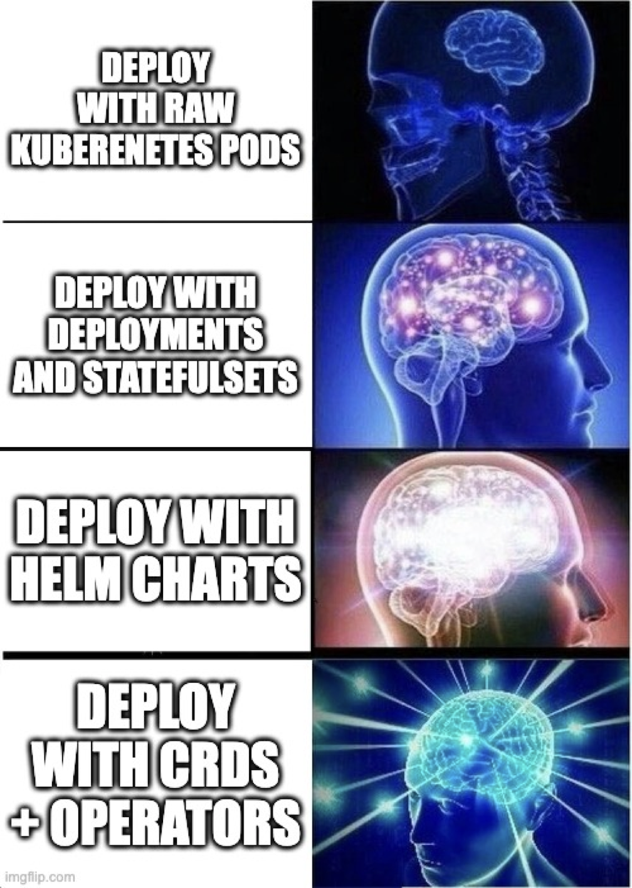

# Extending Kubernetes

Kubernetes base functionality is designed for deploying and operating container based applications.

That being said, the idea of `Declarative State` + `Continuous Reconciliation` is a powerful concept that can be applied to a variety of use cases! Rather than try to include every possible use case within Kubernetes, the authors provided a way to define custom resources that anyone can use to extend the Kubernetes API.

Authors create `CustomResourceDefinitions` (CRDs) which enable Kubernetes to store these resources within `etcd`. They can then reference these CRDs within custom "Controllers" or "Operators" to do all sorts of things.



## Examples

### Extend Existing Capabilities

In the previous section we installed and configured `Traefik`. While kubernetes does provide some ingress capabilities out of the box, Traefik has extended these with a set of their own resources. These can be seen by running (after installing it):

```
❯ k api-resources | grep traefik.containo.us/v
ingressroutes                                  traefik.containo.us/v1alpha1           true         IngressRoute
ingressroutetcps                               traefik.containo.us/v1alpha1           true         IngressRouteTCP
ingressrouteudps                               traefik.containo.us/v1alpha1           true         IngressRouteUDP
middlewares                                    traefik.containo.us/v1alpha1           true         Middleware
middlewaretcps                                 traefik.containo.us/v1alpha1           true         MiddlewareTCP
serverstransports                              traefik.containo.us/v1alpha1           true         ServersTransport
tlsoptions                                     traefik.containo.us/v1alpha1           true         TLSOption
tlsstores                                      traefik.containo.us/v1alpha1           true         TLSStore
traefikservices                                traefik.containo.us/v1alpha1           true         TraefikService
```

These provide additional functionality beyond the official kubernetes Ingress specification.

### Embed Operator Logic

Stateful applications often require carefully sequenced operations to ensure data integrity. These can be hard to encode with the default resource types provided by kubernetes (e.g. StatefulSets).

Another approach is to define custom resources and an operator to encode those logic. In this scenario, the operator application would perform many of the same tasks that a human operator would have in the past. A great example of this (which we will explore in the next section) is CloudNativePG (https://cloudnative-pg.io/).

The operator installs the following CRDs:

```
❯ k api-resources | grep postgres
backups                                        postgresql.cnpg.io/v1                  true         Backup
clusterimagecatalogs                           postgresql.cnpg.io/v1                  false        ClusterImageCatalog
clusters                                       postgresql.cnpg.io/v1                  true         Cluster
imagecatalogs                                  postgresql.cnpg.io/v1                  true         ImageCatalog
poolers                                        postgresql.cnpg.io/v1                  true         Pooler
scheduledbackups                               postgresql.cnpg.io/v1                  true         ScheduledBackup
```

Which then allow the end user to deploy PostgreSQL clusters with a simple interface while also enabling things like backups and connection pooling.

### Deploy External Infrastructure

Operators don't have to operate only on resources within the cluster. For example, Crossplane (https://www.crossplane.io/) is an Infrastructure as Code tool (like Terraform) that runs inside of kubernetes.

Custom resources map to external cloud resources and the Crossplane application handles deploying and managing those external resources. This approach is interesting because it provides automated drift detection/remediation with no additional effort because of the nature of the Kubernetes control loop!
