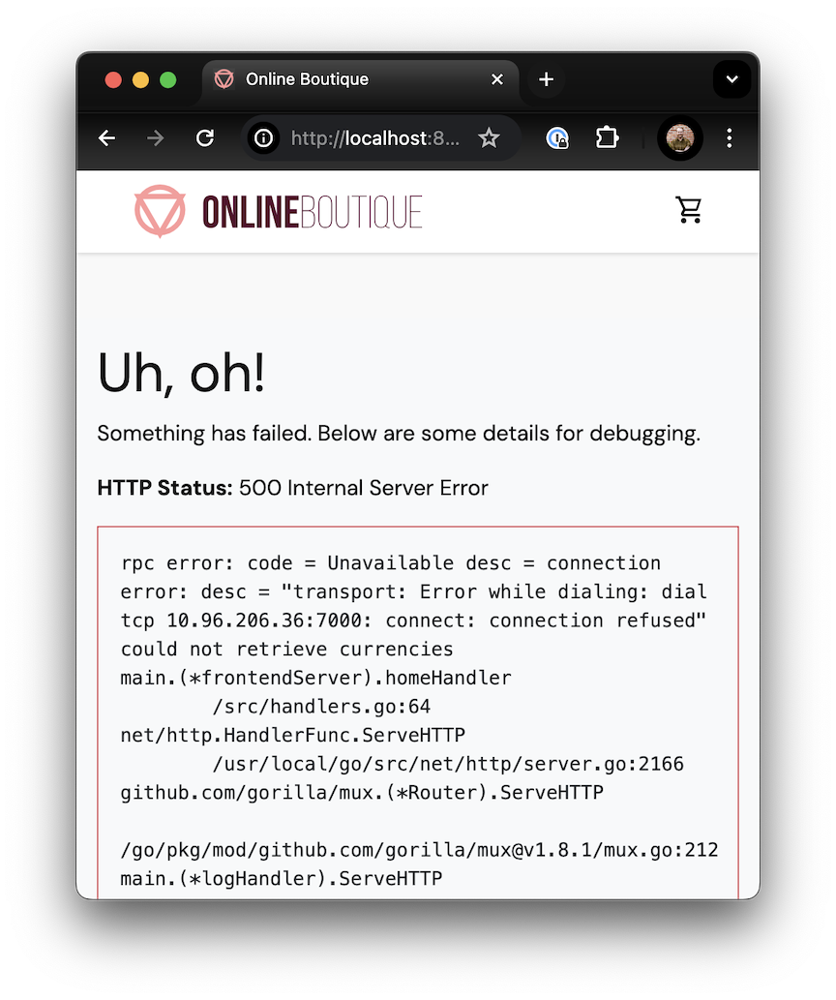

# Debugging In Kubernetes

Sometimes things go wrong. This section is meant to show you misconfigurations that can cause issues and how you would find/fix them.

## Application

The application used for this section is https://github.com/GoogleCloudPlatform/microservices-demo, but with a few intentional breaks.

You can find the specific modifications I made to the configuration here: https://github.com/sidpalas/microservices-demo/pull/1. That being said, DON'T LOOK until you have already gone through the process of debugging it yourself.

## Flow Chart

The folks over at [Learn K8s](https://learnk8s.io/) have published a very useful article and flow chart for troubleshooting deployments within kubernetes:

https://learnk8s.io/troubleshooting-deployments

This can provide a great structure for your debugging process.
