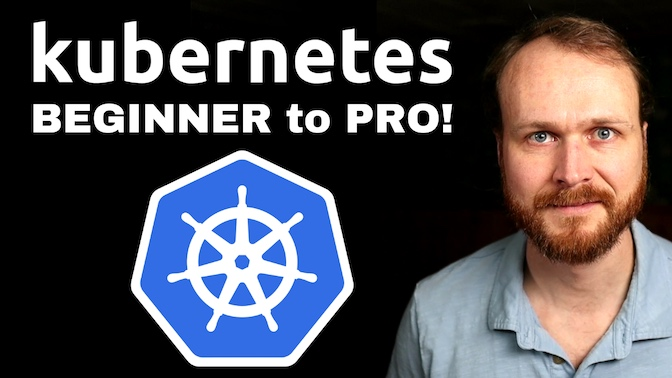

# DevOps Directive Kubernetes Course

This is the companion repo to: [Complete Kubernetes Course -- From BEGINNER to PRO
](https://www.youtube.com/watch?v=2T86xAtR6Fo)

## Using this repo

Each directory within the repo corresponds to one section of the course. You should fork the repo and follow along with the lessons and use/update/modify the code samples as needed.

There are a number of software tools used throughout the course. Instructions on the best way to set them up can be found in [03-installation-and-setup](03-installation-and-setup/README.md).

## Course Sections

### [01 - History and Motivation](01-history-and-motivation/README.md)

Examines the evolution of software operations and how it has led to container orchestration + Kubernetes.

### [02 - Technology Overview](02-technology-overview/README.md)

Provides a high-level overview of Kubernetes architecture and key concepts such as nodes, control plane, and data plane.

### [03 - Installation and Setup](03-installation-and-setup/README.md)

Guides you through setting up your environment and installing necessary tools for the course.

### [04 - Built-in Resource Types](04-built-in-resource-types/README.md)

Covers the fundamental resource types provided by Kubernetes and how to use them.

### [05 - Helm](05-helm/README.md)

Introduces Helm and how to use it for your own applications and installing 3rd party applications.

### [06 - Demo Application](06-demo-application/README.md)

Walks you through a 3 tier web application we will use as the basis for furthering our understanding of deploying with Kubernetes.

### [07 - Deploying Demo Application](07-deploying-demo-application/README.md)

Contains the resource manifests to deploy the demo application to Kubernetes.

### [08 - Extending Kubernetes](08-extending-kubernetes/README.md)

Discusses how applications use custom resource definitions and operators to extend Kubernetes functionalities.

### [09 - Deploying Auxiliary Tooling](09-deploying-auxiliary-tooling/README.md)

Deploys useful 3rd party tools that enhance your Kubernetes environment.

### [10 - Developer Experience](10-developer-experience/README.md)

Focuses on improving the developer experience when working with Kubernetes.

### [11 - Debugging](11-debugging/README.md)

Teaches techniques for debugging issues within your Kubernetes cluster.

### [12 - Deploying to Multiple Environments](12-deploying-to-multiple-environments/README.md)

Explores strategies for deploying applications to multiple environments using Kubernetes.

### [13 - Cluster and Node Upgrades](13-cluster-and-node-upgrades/README.md)

Provides guidance on performing upgrades to your Kubernetes clusters and nodes.

### [14 - CI/CD](14-cicd/README.md)

Discusses how to implement continuous integration and continuous delivery (CI/CD) systems for Kubernetes based applications.
